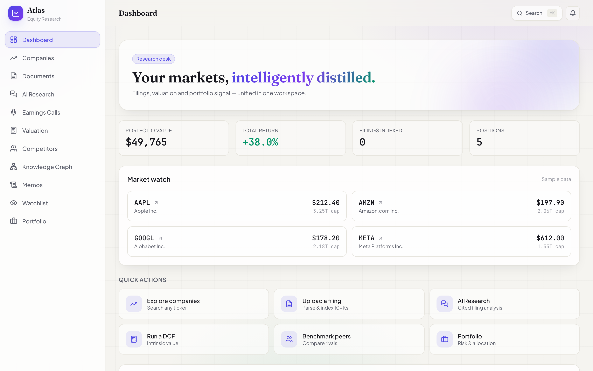
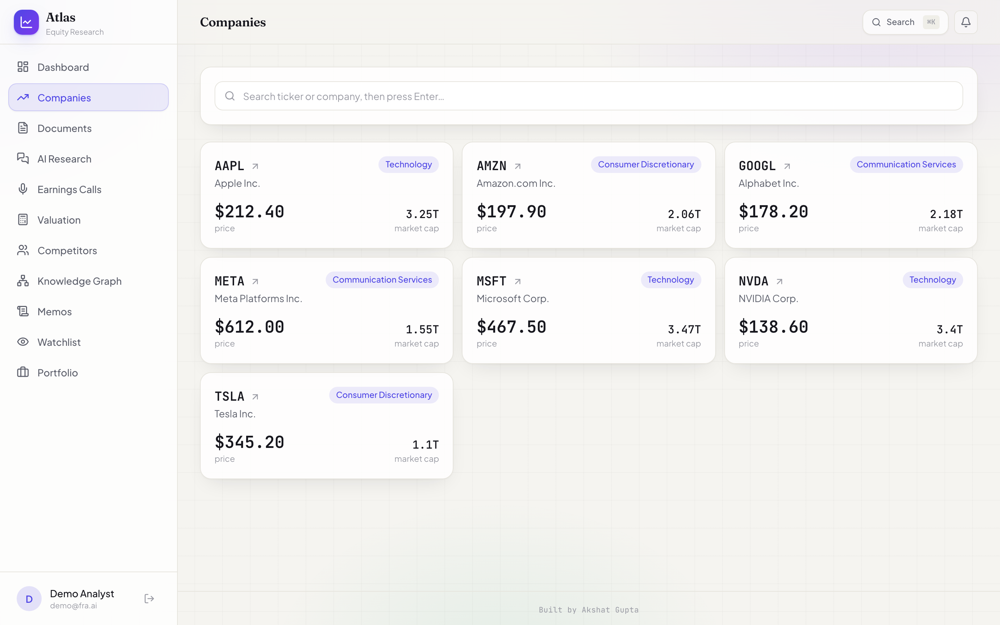
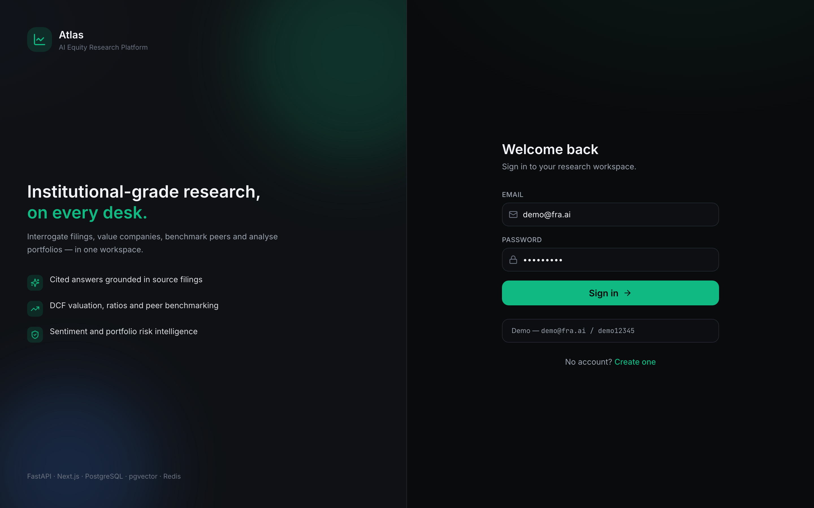
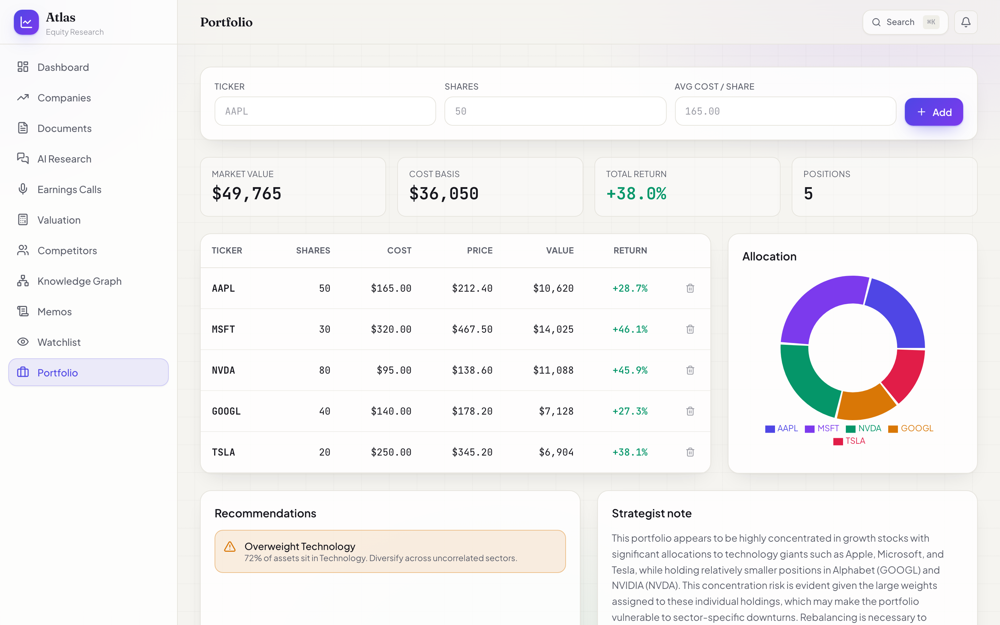
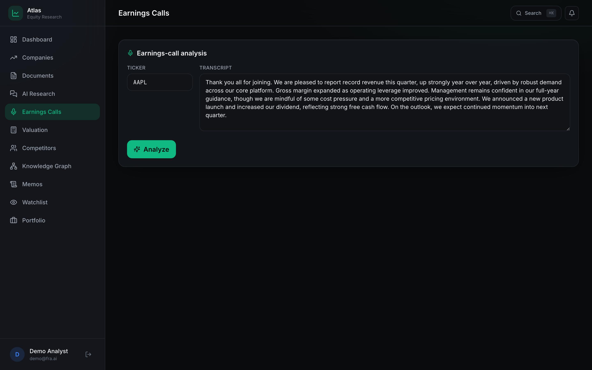

# Atlas — AI Equity Research Platform

A full-stack equity research platform that combines retrieval-augmented document
analysis with a deterministic quantitative engine. Analysts can upload regulatory
filings and interrogate them in natural language with source-cited answers, then
run discounted cash-flow models, ratio diagnostics, peer benchmarking, news
sentiment, and portfolio analytics from a single workspace.

<p>
  <a href="https://ai-financial-research-agent.vercel.app"></a>
  
  
  
  
  
  
  
</p>

> **[Try the live demo →](https://ai-financial-research-agent.vercel.app)**
> Sign up for an account or use the seeded demo credentials (`demo@fra.ai` / `demo12345`). Press `⌘K` / `Ctrl+K` anywhere for the command palette.

## Overview

The platform is organised around two complementary disciplines.

**Document intelligence.** Filings such as 10-Ks, 10-Qs, and annual reports are
parsed, segmented into overlapping passages, embedded, and indexed for semantic
retrieval. Questions are answered strictly from the indexed text, and every
response carries page-level citations so that each assertion remains traceable to
its source. This constraint is deliberate: it prevents the model from speculating
beyond the document and keeps the analysis defensible.

**Quantitative analysis.** A deterministic finance engine computes intrinsic value
through a discounted cash-flow model (with terminal value and a two-dimensional
sensitivity surface), evaluates a battery of liquidity, profitability, leverage,
and valuation ratios against rule-of-thumb benchmarks, benchmarks a company against
its peers, and surfaces concentration and rebalancing signals across a portfolio.

The system is engineered to operate end-to-end without external dependencies. In
the absence of a language-model provider or a database server, it degrades
gracefully to SQLite, a local embedding model, and a curated reference dataset,
preserving full functionality for evaluation. Supplying API credentials promotes
it to live inference and market data without any code change.

## Capabilities

| Domain | Description |
|---|---|
| Filing ingestion | Parses PDF and text filings, segments them into citable passages, embeds each passage, and persists the index. |
| Conversational analysis | Answers questions against the indexed corpus using retrieval-augmented generation, returning page-level citations for provenance. |
| Filing summaries | Produces an executive summary and a set of salient highlights for each uploaded document. |
| Intrinsic valuation | A discounted cash-flow model with configurable growth, discount rate, and terminal growth, plus a WACC × terminal-growth sensitivity grid. |
| Ratio diagnostics | Computes liquidity, profitability, leverage, efficiency, and valuation ratios and consolidates them into a 0–100 financial-health score. |
| Peer benchmarking | Compares a target against its peers across valuation multiples, margins, returns, and leverage. |
| News sentiment | Aggregates recent headlines and scores tone with a transparent lexicon, accompanied by a narrative summary. |
| Investment memos | Composes an institutional, ten-section memo with a Buy/Hold/Sell rating, price target, and one-click PDF export. |
| Earnings-call analysis | Scores tone, estimates management confidence, and ranks discussed topics from a transcript. |
| Knowledge graph | Interactive company / sector / peer graph (Neo4j-ready), explorable by hops. |
| Portfolio analytics | Marks holdings to market, derives allocation and return, and issues rule-based concentration and rebalancing guidance. |
| Watchlist & alerts | Tracked tickers with generated daily-update notifications. |
| Authentication | Stateless JWT plus optional Google / GitHub OAuth; per-user data isolation. |

## Architecture

```
┌──────────────────┐      HTTPS / JWT       ┌─────────────────────────┐
│  Next.js (Vercel)│ ─────────────────────► │   FastAPI (Render)      │
│  App Router      │ ◄───────────────────── │                         │
└──────────────────┘                        │  auth · documents       │
                                            │  chat · valuation       │
        ┌────────────────────┐              │  ratios · competitors   │
        │  LLM provider       │ ◄── service ─┤  sentiment · portfolio  │
        │  (Anthropic/OpenAI) │   layer      └────────────┬────────────┘
        └────────────────────┘                           │ SQLAlchemy
                                    ┌────────────────────┼────────────────┐
                                    │                    │                │
                              ┌─────▼──────┐    ┌───────▼──────┐  ┌─────▼─────┐
                              │ PostgreSQL  │    │    Redis     │  │  Workers  │
                              │  (Neon)     │    │  (Upstash)   │  │   (RQ)    │
                              └────────────┘    └──────────────┘  └───────────┘
```

The backend exposes a versioned REST API. A provider-agnostic service layer
abstracts language-model access behind a single interface, so the same code path
serves a local Ollama model, Anthropic, OpenAI, or the offline fallback. Persistence is handled through
SQLAlchemy, allowing the identical schema to run on SQLite during development and
PostgreSQL in production. The web client is a Next.js (App Router)
application with a command-palette-driven, information-dense interface.

## Technology

- **Backend** — FastAPI, SQLAlchemy 2, Pydantic v2, JWT (python-jose, passlib),
  repository-pattern data access, Redis cache, RQ workers, Alembic migrations, structured logging.
- **Frontend** — Next.js 14 (App Router), TypeScript, Tailwind CSS, TanStack
  Query, Zustand, Framer Motion, Recharts, and a ⌘K command palette.
- **Data and AI** — PostgreSQL (Neon), Redis (Upstash), a
  retrieval-augmented pipeline, and a provider-agnostic LLM layer.
- **Market and news data** — yfinance and an optional news provider, each with a
  deterministic offline fallback.
- **Infrastructure** — Docker Compose, Vercel (frontend), Render (backend), Neon (Postgres), Upstash (Redis).

## Screenshots

### Dashboard
Home view with portfolio KPIs, market watch, and quick-access links to all major workflows.


### Company Research
Searchable universe and detailed company profiles with tabs for overview, financials, valuation, competitors, and news.



### DCF Valuation
Interactive discounted cash-flow model with live assumption sliders (growth, WACC, terminal growth) and a WACC × terminal-growth fair-value sensitivity heatmap.


### Knowledge Graph
Interactive company/sector/peer network, explorable by hops. Neo4j-ready node-edge shape.


### AI Research Workspace
Three-panel interface: interrogate uploaded filings with RAG (left), get cited answers (center), suggestions (right).


### Investment Memos
Generate ten-section institutional memos with Buy/Hold/Sell ratings, price targets, and one-click PDF export.


### Portfolio Management
Manage holdings, track allocation, and receive rule-based concentration and rebalancing guidance.


### Peer Benchmarking
Compare against competitors across valuation multiples, margins, returns, and leverage.


### Watchlist & Notifications
Track tickers with daily-update notifications (earnings alerts, analyst action, news highlights, insider activity).


### Earnings-Call Analysis
Score tone, estimate management confidence, and rank discussed topics from earnings transcripts.


## Live Demo

| Service | URL |
|---|---|
| **Frontend** | [ai-financial-research-agent.vercel.app](https://ai-financial-research-agent.vercel.app) |
| **API Docs** | [atlas-api on Render → /docs](https://ai-financial-research-agent.vercel.app) |

The demo runs in offline mode (`LLM_PROVIDER=demo`) with deterministic output — no API keys required. Sign up for an account or use `demo@fra.ai` / `demo12345`.

## Getting started

### Prerequisites

Python 3.12+ and Node.js 20+. Docker is optional and only required for the
containerised workflow.

### Local development

Start the API:

```bash
cd backend
python3 -m venv .venv
source .venv/bin/activate
pip install -r requirements.txt
python -m app.seed
uvicorn app.main:app --reload --port 8000
```

The interactive API documentation is then available at `http://localhost:8000/docs`.

In a separate terminal, start the web client (Next.js):

```bash
cd web
npm install
npm run dev
```

Open `http://localhost:3000` and sign in with the seeded account
(`demo@fra.ai` / `demo12345`). Tip: press `⌘K` / `Ctrl+K` anywhere for the
command palette.

### Containerised deployment

```bash
cp .env.example .env   # optionally add provider credentials
docker compose up --build
```

This provisions PostgreSQL, Redis, the API, and the web client. A
`Makefile` provides equivalent shortcuts: `make install`, `make backend`,
`make frontend`, `make seed`, `make test`, and `make docker-up`.

## Configuration

Configuration is read from environment variables; copy `.env.example` to `.env`
to begin. The most relevant settings are:

| Variable | Default | Purpose |
|---|---|---|
| `DATABASE_URL` | SQLite | Connection string; use PostgreSQL in production. |
| `REDIS_URL` | — | Redis connection; empty falls back to in-process cache. |
| `SECRET_KEY` | placeholder | JWT signing secret (`openssl rand -hex 32`). |
| `LLM_PROVIDER` | `ollama` | Selects `ollama` (local), `anthropic`, `openai`, or the `demo` offline fallback. |
| `CORS_ORIGINS` | `localhost:3000,...` | Comma-separated allowed origins. |
| `OLLAMA_BASE_URL` / `OLLAMA_MODEL` | `localhost:11434` / `llama3.2` | Local Ollama endpoint and model. |
| `ANTHROPIC_API_KEY` | — | Enables Anthropic inference. |
| `OPENAI_API_KEY` | — | Enables OpenAI inference and embeddings. |
| `NEWSAPI_KEY` | — | Enables live news retrieval; otherwise sample data is used. |
| `NEXT_PUBLIC_API_URL` | `http://localhost:8000` | API base URL consumed by the web client. |

When no provider key is configured, the application runs in its offline mode with
deterministic output. When no embedding provider is available, a local embedding
model powers semantic retrieval.

## Deployment

The production deployment uses entirely free-tier services:

| Component | Provider | Plan |
|---|---|---|
| Frontend | [Vercel](https://vercel.com) | Free |
| Backend API | [Render](https://render.com) | Free |
| PostgreSQL | [Neon](https://neon.tech) | Free (no expiry) |
| Redis | [Upstash](https://upstash.com) | Free (no expiry) |

See [DEPLOY.md](DEPLOY.md) for detailed setup instructions.

## Testing

```bash
cd backend
source .venv/bin/activate
pytest
```

The suite covers the valuation mathematics, ratio computations, the authentication
flow, filing ingestion with retrieval-augmented chat, and each analytical endpoint.

## API reference

| Method | Endpoint | Description |
|---|---|---|
| `POST` | `/api/auth/register`, `/api/auth/login` | Account creation and authentication. |
| `GET`, `POST`, `DELETE` | `/api/documents` | Filing management. |
| `POST` | `/api/chat/ask` | Cited question answering over filings. |
| `POST` | `/api/valuation/dcf` | Discounted cash-flow valuation and sensitivity. |
| `POST` | `/api/ratios` | Ratio analysis and health score. |
| `POST` | `/api/competitors` | Peer benchmarking. |
| `POST` | `/api/sentiment` | News sentiment analysis. |
| `GET`, `POST` | `/api/portfolio/*` | Holdings and recommendations. |
| `POST`, `GET` | `/api/v1/memo`, `/api/v1/memo/{id}/pdf` | Investment memo generation and PDF export. |

Complete, interactive documentation is available at `/docs`.

## Disclaimer

This project is intended for educational and research purposes. It does not
constitute financial advice. All valuations, ratios, and recommendations are model
outputs and should be independently verified before any decision is made.

## License

Released under the MIT License. Copyright © 2026 Akshat Gupta.
